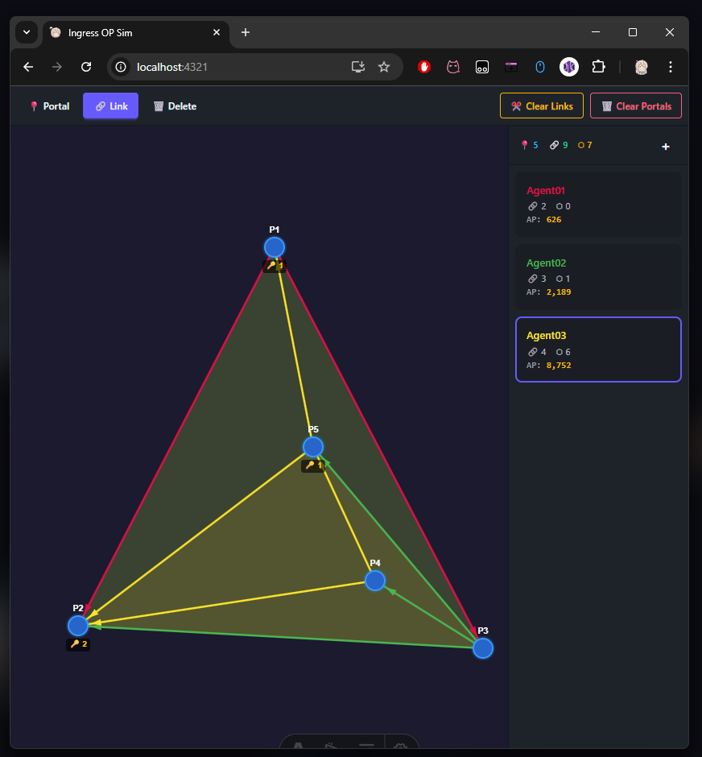

# Ingress OP Sim

A web-based planning tool for [Ingress](https://ingress.com/) operations. Place portals on a canvas, build links between them, form control fields, and track per-agent AP in real time.

## Features

- **Portal placement** — Click the canvas to drop portals (auto-named P1, P2, …)
- **Link creation** — Select an agent, click two portals to link them
- **Field detection** — Triangles are auto-detected when a link completes a closed loop; multi-layer overlapping fields are fully supported
- **Ingress rule enforcement** — Links that would cross an existing link are rejected, just like in the game
- **Multi-agent tracking** — Add up to 16 agents, each with independent link count, field count, and AP
- **AP calculation** — +313 AP per link, +1250 AP per field, updated in real time
- **Cascade deletion** — Deleting a portal removes all its links and dependent fields; deleting a link removes its fields
- **PWA support** — Installable as a Progressive Web App for offline use

## Getting Started

Open the app in your browser. No login or installation required.

## How to Use

### Tools

The toolbar at the top has three modes:

| Tool | What it does |
|------|-------------|
| **Portal** | Click an empty area on the canvas to place a new portal |
| **Link** | Click portal A, then portal B to create a link between them |
| **Delete** | Click a portal to remove it (and all connected links/fields), or click a link to remove just that link |

### Agents

- The right panel shows all agents and their stats
- Click an agent card to select them — all new links will be credited to the selected agent
- Use the **+** button to add more agents (up to 16)
- Each agent independently tracks link count, field count, and AP

### Clearing

- **Clear Portals** — Removes all portals, links, and fields; resets all agent stats
- **Clear Links** — Removes all links and fields but keeps portals in place

## Roadmap

Planned features for future releases:

1. **Operation timeline** — Record every action in a step-by-step timeline
2. **Export key lists** — Export per-agent key lists and operation sequences
3. **IITC import** — Import real portal data from IITC for planning
4. **Plan sharing** — Export and import operation plans to share with other agents
5. **Event scoring** — Calculate scores for Ingress events (e.g., All kinds of Global ops)

## License

MIT
