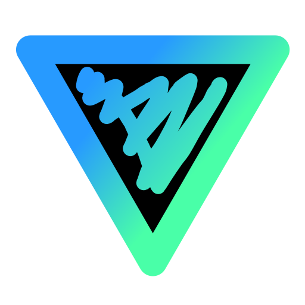

  

<h1 align="center">Ingress OP Sim</h1>

  A web-based planning tool for <a href="https://ingress.com/">Ingress</a> operations. 
  Place portals, build links, form control fields, and track per-agent stats in real time.

  <a href="https://szres.github.io/ingress-op-sim/">Launch App</a>

## Quick Start

Open the [app](https://szres.github.io/ingress-op-sim/) in your browser. No login or installation required. Works offline after first visit (PWA).

  

## Demo Video

## Features

- **Portal placement** — Click the canvas to drop portals (auto-named P1, P2, …), or import from IITC
- **Link creation** — Select an agent, click two portals to link them
- **Field detection** — Triangles are auto-detected when a link completes a closed loop; multi-layer overlapping fields are fully supported
- **Ingress rule enforcement** — No crossing links, outbound link limit of 40 per portal (4 SBUL mods)
- **Multi-agent tracking** — Up to 16 agents, each with independent link count, field count, AP, and event score
- **AP calculation** — +313 AP per link, +1250 AP per field, updated in real time
- **Scoring rules** — Built-in event scoring (e.g. 2026 Orion Global Op) with per-agent breakdown
- **Timeline playback** — Record every link action, scrub or auto-play the operation step by step
- **GIF export** — Export the timeline as an animated GIF to share with your team
- **Plan export / import** — Save and load entire operation plans as JSON files
- **Key export** — Export per-agent key consumption as a markdown table
- **IITC import** — Import real portal locations from [IITC](https://iitc.app/) using the [Multi Export](https://github.com/modkin/Ingress-IITC-Multi-Export) plugin (JSON format)
- **Light / dark theme** — Toggle between themes; preference is saved locally
- **PWA support** — Installable as a Progressive Web App for offline use

## How to Use

### Tools

The toolbar at the top provides the following tools:

| Tool | What it does |
|------|-------------|
| **Portal** | Click an empty area on the canvas to place a new portal (disabled when portals are imported from IITC) |
| **Link** | Click portal A, then portal B to create a link between them |
| **Delete** | Click a portal to remove it (and all connected links/fields), or click a link to remove just that link |
| **Import IITC** | Import portals from an IITC JSON export; clears existing data and switches to link mode |
| **Import Plan** | Load a previously saved plan (portals, agents, timeline) |
| **Export Plan** | Save the current plan as a JSON file |

### Agents

- The right panel shows all agents and their stats (link count, field count, AP, event score)
- Click an agent card to select them — all new links will be credited to the selected agent
- Press number keys `1`–`9` to quickly select agents by position
- Use the **+** button to add more agents (up to 16)

### IITC Portal Import

1. Install the [Ingress IITC Multi Export](https://github.com/modkin/Ingress-IITC-Multi-Export) plugin
2. In IITC, export your portals using the **JSON** format
3. Click **Import IITC** in the toolbar and select the JSON file
4. Portals will appear on the canvas with their real locations; hover to see portal names

### Timeline

Use the timeline bar at the bottom to:

- Scrub through the operation step by step
- Auto-play forward or backward at adjustable speed
- Export the entire playback as an animated GIF

### Scoring Rules

Select a scoring rule from the dropdown in the toolbar to calculate event-specific scores for each agent. Currently includes:

| Event | Link | Field (1 agent) | Field (2 agents) | Field (3 agents) |
|-------|------|-----------------|-------------------|-------------------|
| 2026 Orion Global Op | +2 | +4 each | +12 each | +30 each |

## License

MIT
